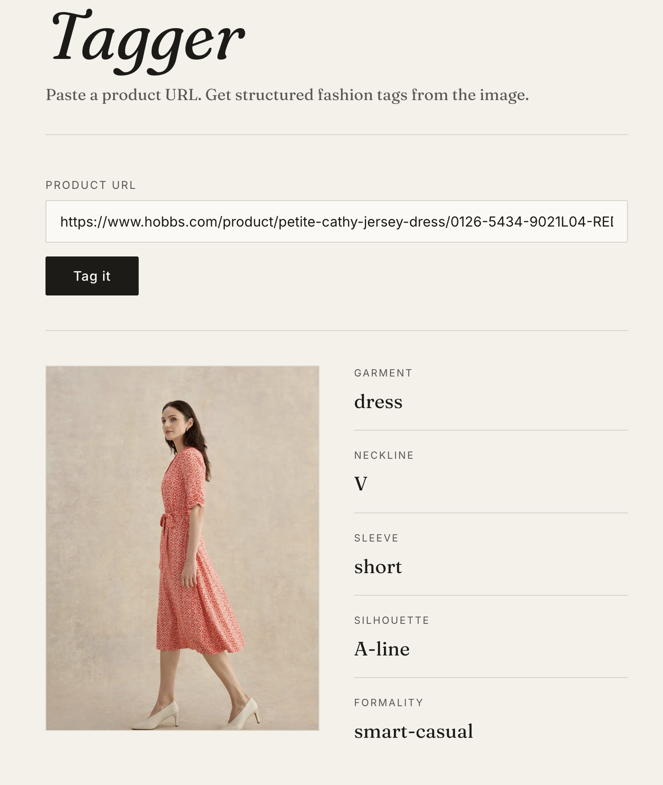

# Fashion Tagger

Paste a product URL, get back five structured fashion attributes.

The app pulls the main product image from the page's `og:image` meta tag, sends it to Claude's vision API with a JSON-schema constraint, and renders the tags next to the image.

## Screenshot



_Hobbs petite Cathy jersey dress, correctly tagged as: dress · V-neck · short sleeve · A-line · smart-casual._

## Attributes extracted

| Attribute       | Possible values                                                            |
| --------------- | -------------------------------------------------------------------------- |
| `garment_type`  | dress, top, trousers, skirt, jacket, knitwear, other                       |
| `neckline`      | crew, V, scoop, square, halter, off-shoulder, N/A                          |
| `sleeve_type`   | sleeveless, short, long, 3/4, cap, puff, N/A                               |
| `silhouette`    | fitted, A-line, oversized, straight, flared, cropped                       |
| `formality`     | casual, smart-casual, formal, occasion                                     |

The five values are returned as a JSON object validated against a JSON schema, so you'll always get exactly these keys with values from the allowed enums.

## Tech stack

- **Backend** — Python 3.10+, [FastAPI](https://fastapi.tiangolo.com/), uvicorn
- **Vision model** — [Anthropic SDK](https://github.com/anthropics/anthropic-sdk-python), Claude Opus 4.7 with structured JSON output
- **Scraping** — `requests` + `beautifulsoup4` for `og:image` extraction (with `twitter:image` fallback)
- **Frontend** — vanilla HTML / CSS / JavaScript, no build step, no framework
- **Config** — `python-dotenv`

## Run locally

You'll need Python 3.10+ and an Anthropic API key from [console.anthropic.com](https://console.anthropic.com/).

```bash
git clone https://github.com/zolisia/fashion-tagger.git
cd fashion-tagger

python3 -m venv .venv
source .venv/bin/activate

pip install -r requirements.txt

cp .env.example .env
# open .env and paste your ANTHROPIC_API_KEY

uvicorn main:app --reload --port 8000
```

Then open http://localhost:8000 and paste a product URL.

## How it works

1. Frontend POSTs `{url}` to `/api/tag`.
2. Backend fetches the page HTML, finds `<meta property="og:image">` (falling back to `og:image:secure_url` and `twitter:image`), and resolves any relative URL against the page URL.
3. Backend downloads the image bytes and base64-encodes them.
4. Claude `claude-opus-4-7` is called with the image plus a JSON-schema constraint that enforces the five attributes and their enums.
5. Frontend renders the image and tags side-by-side.

A request takes 3–5 seconds end-to-end depending on image size.

## Known limitations

**Bot-protected retailers.** Many large fashion sites (Net-a-Porter, Zara, Farfetch, SSENSE) detect non-browser HTTP clients and either return 403 or hang until the request times out. A plain Chrome user-agent isn't enough to get past their protection. If a URL fails with "couldn't load that page", that's almost always the cause — the code is fine, the retailer just doesn't want to be scraped. Workarounds (not in scope here) would be a headless-browser fetcher (Playwright) or a paid scraping API.

**Pages with no `og:image`.** Most retailers include one, but if they don't, the app returns a friendly 422 error and asks for a different link.

**Single-garment images only.** The model is prompted to tag the main garment in the photo. Flat-lays with multiple items, or full outfits on a model with several pieces, will be tagged based on whichever garment the model considers primary.

**Cost.** Each tag call is one Claude Opus 4.7 vision request — roughly $0.005–0.01 per request at typical image sizes. To cut costs ~5×, swap to `claude-haiku-4-5` in `main.py`.

**No persistence.** No database, no history, no accounts. By design — this is the simplest version that works.

## Project structure

```
fashion-tagger/
├── main.py              # FastAPI app: og:image extraction + Claude vision call
├── requirements.txt
├── .env.example         # template — copy to .env and add your key
├── .gitignore           # .env and venv excluded
├── static/
│   ├── index.html
│   ├── style.css
│   └── script.js
├── Tagger.png           # screenshot used in this README
└── README.md
```

## Roadmap

- [ ] Playwright fallback for bot-protected retailers
- [ ] Expanded taxonomy (color, fabric, pattern)
- [ ] Batch tagging from CSV of URLs
- [ ] Optional persistence layer for tagged history

---

Built by zolisia · April 2026
